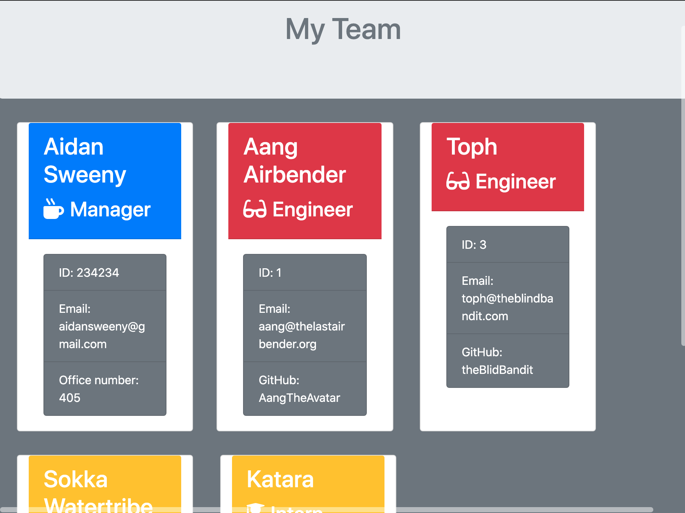

# template-engine
For this Project I created a template engine, that will create cards for different memebers of a team through command line arguments. This project is run through the use of inquirer, which will prompt the user with questions, and jest, which was used for testing. For this project to run I had first run the test files that we were given, and then figure out what methods and parameters I needed to create for the classes. The parent class employee had the paramters id, name, and email. All of the users would need these parameters, but itern was given the additional parameter of school, manager was given office number, and engineer was given github username. With these inherited, and created parameters I was able to ask the user for information using inquirer, and then set this information to a new document. I used the fs library so that I could write to a file. I also used the async function so that I could make the program wait for other sections to finish before moving on. Once I had written to the file using the templates, I styled them, and made sure that when more people were added, they would populate below the others. This took some time to figure out how to get them to not jus span in one direction. Below is an image of the displayed cards with the members occupations:



## Getting Started

To get this project running, one must copy the files from the class repository, and run an `npm install` on the correct directory.

### Prerequisites

To have this project run, one must download VS Code off the appstore, and create a GitHub account. Git is also required to run this program, which can be downloaded 

```
$ brew install git. 
```
Homebrew can also be downloaded by inputting the following command in the terminal:
```
/bin/bash -c "$(curl -fsSL https://raw.githubusercontent.com/Homebrew/install/master/install.sh)"
```

### Installing

To install this project one must go through the GitHub website in order to clone this project. Clicking on the cone or download button and then copying the link that comes from that. One can then go into the Terminal application, and use the following command to copy the files:
`
git clone URL
`
This should then be moved to your desktop, or somewhere else on your computer. This will allow access to the html and css files. Opening the html file in a default browser will allow one to observe the website.

## Built With

* [HTML](https://developer.mozilla.org/en-US/docs/Web/HTML)
* [CSS](https://developer.mozilla.org/en-US/docs/Web/CSS)
* [Javascript](https://developer.mozilla.org/en-US/docs/Web/JavaScript)

## Deployed Link

* [See Live Site](https://aidansweeny.github.io/template-engine/)

## Authors

* Aidan Sweeny

- [Link to Github](https://github.com/AidanSweeny)
- [Link to LinkedIn](https://www.linkedin.com/in/aidan-sweeny-81075030/)

## License

This project is licensed under the MIT License 

## Acknowledgments

* Berkley Coding Bootcamp


